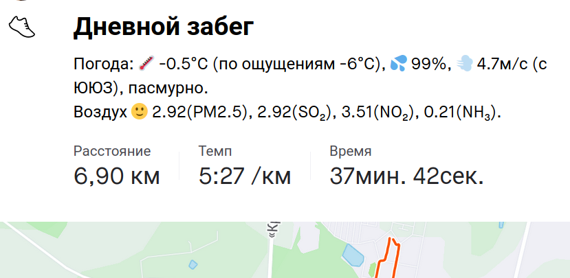
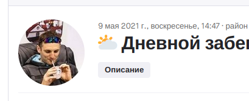

[](https://github.com/vol1ura/strava_weather_app/actions/workflows/python-app.yml)
[](https://codecov.io/gh/vol1ura/strava_weather_app)
[](https://www.python.org/dev/peps/pep-0008/) 

[](http://perso.crans.org/besson/LICENSE.html)


# Strava Weather

Web application to add weather conditions to description of Strava activities. You can deploy this application as your own private app with your custom weather server and personal API tokens.
It is a free analog to Premium [klimat.app](http://klimat.app)

In application set russian language for description by default.

## Main features:

* You will get brief description of weather condition.
* Your own workout description will be saved and added to the description as well.
* You can select the metrics to be used in the description.
* No fees, no advertising, no branding and any additional marks.
* Air quality and pollution measurement data.
* You can select language -  russian or english.
* You can suggest your wishes and ideas in Issues. I will try to take them into account and implement them if I can.



You can also set adding only an emoji in the activity title:



### Run tests

```shell
pip install -r tests/requirements.txt
pytest --cov-report=term-missing:skip-covered --cov=. tests/
```
